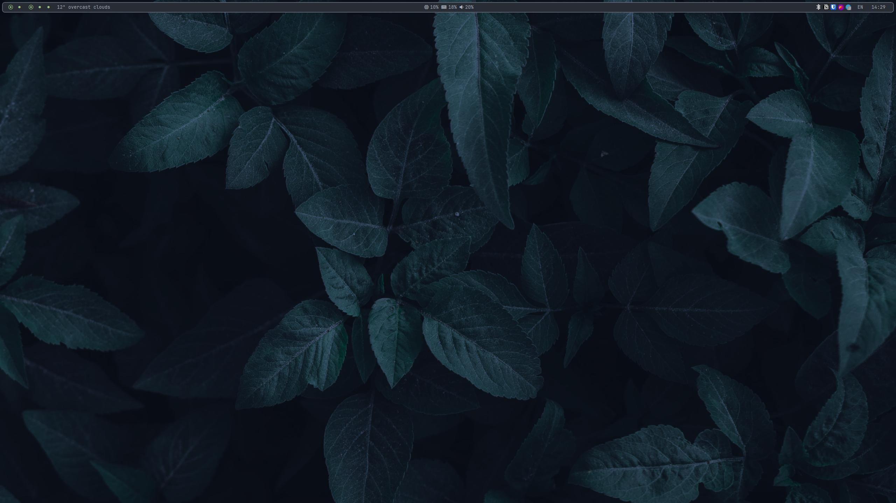
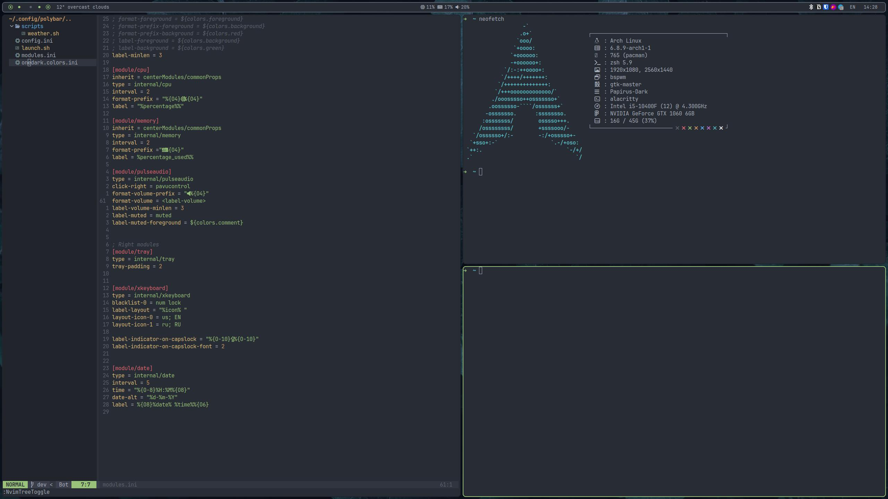
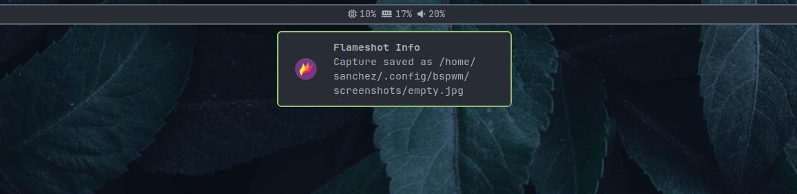

## Dots
Colors based on Onedark pallete

- Window Manager: [Bspwm](https://github.com/baskerville/bspwm)
- Panel: [Polybar](https://github.com/polybar/polybar)
- Launcher: [Rofi](https://github.com/davatorium/rofi)
- Notify Daemon: [Dunst](https://github.com/dunst-project/dunst)
- File Manager: [Thunar](https://gitlab.xfce.org/xfce/thunar)
- Terminal: [Alacritty](https://github.com/alacritty/alacritty)
- Font: [JetBrainsMono Nerd Font](https://www.nerdfonts.com/)

 

<b>Dependencies</b>

 

> Later

 

### Roadmap
- [ ] - Dependencies list
- [ ] - GTK theme
- [ ] - Monochrome tray icons
- [ ] - Power menu icons
- [ ] - eww widgets

